<p align="center">
  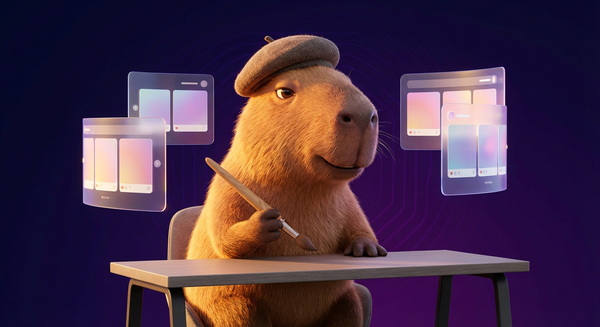
</p>

<h1 align="center">World-Class Instagram Carousel Generator</h1>

<p align="center">
  <strong>An AI agent skill that generates publication-ready Instagram carousels on any topic.</strong><br/>
  7-10 slides at 1080x1350 with AI visuals, LaTeX typography, music recommendations, and optimized captions.
</p>

<p align="center">
  
  
  
  
  
</p>

---

## Why Carousels?

<p align="center">
  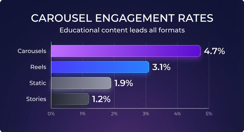
</p>

Carousels are the highest-performing format on Instagram. The data is clear:

- **4.7% average engagement** for educational carousels (highest of any format)
- **95-114% more saves** than static image posts
- **3.4% save rate** for educational content (saves = algorithm gold)
- **First slide = 80%** of the engagement decision (made in under 1.5 seconds)

This skill exists because most carousel tools produce generic, forgettable content. This one produces carousels people **save, share, and come back to**.

---

## How It Works: The 6-Phase Pipeline

<p align="center">
  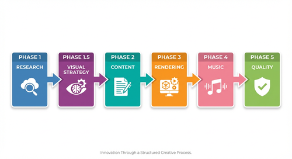
</p>

| Phase | What Happens | Output |
|-------|-------------|--------|
| **1. Research** | Topic analysis, audience mapping, archetype selection, narrative arc | Content outline |
| **1.5. Visual Strategy** | Decide AI images vs text-only per slide, theme, background style | Visual plan |
| **2. Content** | Write each slide, run Bullshit Test, map to renderer data format | Slide JSON files |
| **3. Rendering** | LaTeX pipeline: TikZ + pdflatex + pdftoppm at 300 DPI | 1080x1350 PNGs |
| **4. Music** | Match content type to Instagram music library tracks | 2-3 track recs |
| **5. Quality** | Visual inspection, checklist verification, re-render failures | Final carousel |

The rendering pipeline produces output that matches or exceeds accounts with 1M+ followers (Chase AI, Analytics Vidhya, etc.) because it uses the same typesetting engine that produces academic papers and books.

---

## 6 Slide Types

<p align="center">
  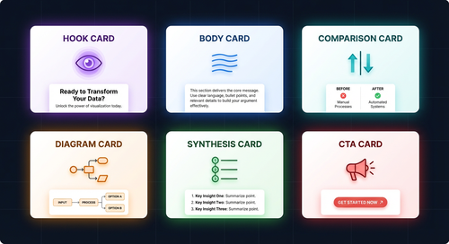
</p>

| Type | Purpose | Visual Strategy |
|------|---------|----------------|
| **Hook** | Scroll-stopping first impression | AI background + 0.60-0.68 overlay |
| **Body** | Content-heavy knowledge delivery | Text-only with gradient background |
| **Comparison** | Side-by-side analysis | Multi-column layout, text-only |
| **Diagram** | Architecture, workflows, processes | AI-generated flowchart (preferred) or TikZ |
| **Synthesis** | Save-worthy numbered summary | Text-only, numbered points |
| **CTA** | Call to action, emotional close | AI background + 0.65-0.70 overlay |

### The Proven Formula (8-Slide Format)

```
Hook (ai_bg) -> Body -> Body -> Body -> Body -> Diagram (ai_bg) -> Synthesis -> CTA (ai_bg)
```

This structure was established through controlled A/B experiments. Key finding: **images on body slides destroy 40% of content space for minimal gain**. Text-only body slides scored 8.3/10 vs 5.7/10 with images.

---

## Example Carousel Output

Here is a complete 8-slide carousel on "The AI War of 2025" rendered with this skill:

<table>
<tr>
<td align="center">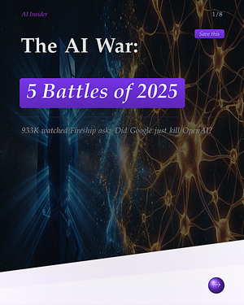<br/><sub>Hook</sub></td>
<td align="center">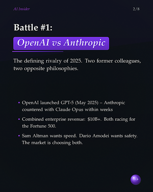<br/><sub>Body 1</sub></td>
<td align="center">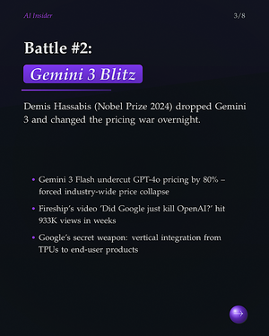<br/><sub>Body 2</sub></td>
<td align="center">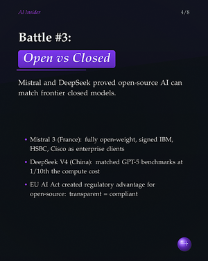<br/><sub>Body 3</sub></td>
</tr>
<tr>
<td align="center">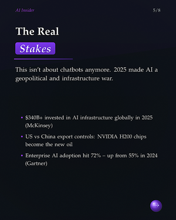<br/><sub>Body 4</sub></td>
<td align="center">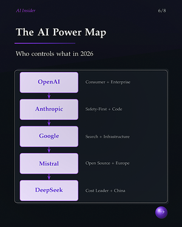<br/><sub>Diagram</sub></td>
<td align="center">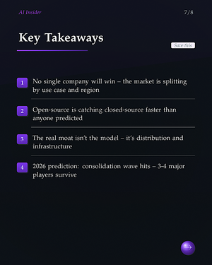<br/><sub>Synthesis</sub></td>
<td align="center">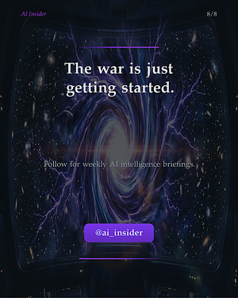<br/><sub>CTA</sub></td>
</tr>
</table>

Notice: Hook and CTA use full-bleed AI backgrounds for scroll-stopping power. Body slides are text-only with gradient backgrounds for maximum readability. The diagram uses TikZ vector graphics.

---

## AI Image Generation Capabilities

This skill uses **Gemini 3 Pro** (via the `generate-image` skill) for AI-generated visuals. Here are experimentally verified capabilities:

### Cinematic Portraits


Best for hook and CTA backgrounds. Hyper-detailed prompts (50+ words) produce stunning atmospheric images.

### Flowcharts & Process Diagrams
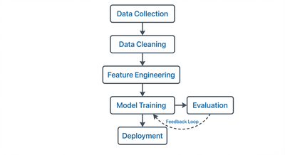

Game-changer for diagram slides. Gemini 3 Pro renders clean boxes, arrows, and **readable text labels** -- replacing TikZ for complex flows.

### Architecture Diagrams
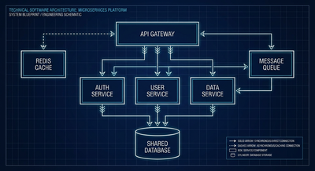

Blueprint-style system diagrams with proper components and connections. Ideal for tech/system design carousels.

### Data Infographics & Bar Charts
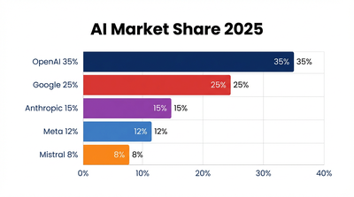

Accurate data visualization with labels, proportions, and colors. Specify exact numbers in the prompt for best results.

### Abstract Backgrounds


Neural networks, cosmic patterns, geometric visuals. Perfect as `ai_bg` with overlay for any slide type.

---

## Viral Hook Compositing Pipeline

A two-step pipeline that produces scroll-stopping hook slides matching the visual language of top accounts like @evolving.ai (27.5K likes, 30.1K saves) and @therundownai:

**Step 1:** Generate cinematic base image with Gemini 3 Pro (topic-specific) | **Step 2:** Compose with PIL overlay (gradient + headline + brand + CTA)

<table>
<tr>
<td align="center">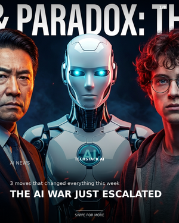<br/><sub>Multi-Person (8.5/10)</sub></td>
<td align="center">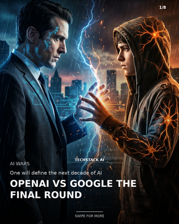<br/><sub>Face-Off (8.5/10)</sub></td>
<td align="center">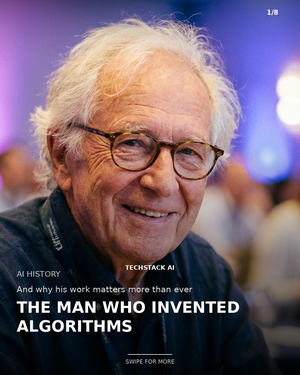<br/><sub>Portrait (8/10)</sub></td>
<td align="center">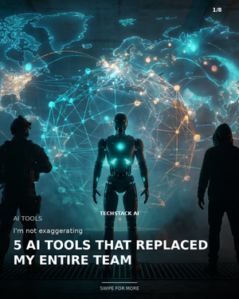<br/><sub>Silhouette (7.5/10)</sub></td>
</tr>
</table>

```bash
# Step 1: Generate base image
python3 ~/.claude/skills/generate-image/scripts/generate_image.py \
  "Cinematic photomontage: three figures in dramatic formation..." \
  --model "google/gemini-3-pro-image-preview" --output hook_base.png

# Step 2: Compose with text overlays
python3 scripts/compose_hook.py \
  --base hook_base.png --output hook_final.png \
  --headline "THE AI WAR JUST ESCALATED" \
  --brand "YOUR BRAND" --category "AI NEWS"
```

The compositing script adds: gradient overlays, bold headline, brand watermark, category label, "SWIPE FOR MORE" CTA, and slide counter. All topic-adaptive, not hardcoded.

### Real-Face Hook Pipeline (10/10)

For news/current events topics featuring **real recognizable people**, use web-sourced Creative Commons photos instead of AI generation:

<table>
<tr>
<td align="center">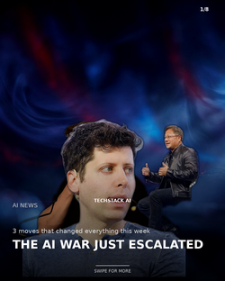<br/><sub>A: PIL rembg (7/10)</sub></td>
<td align="center"><br/><sub>B: Flickr URLs (9.5/10)</sub></td>
<td align="center"><br/><sub>C: Base64 3 photos (9/10)</sub></td>
<td align="center">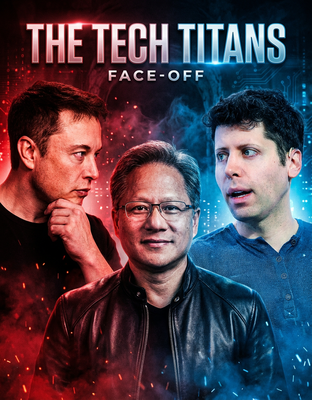<br/><sub>D: Base64 face-off (10/10)</sub></td>
</tr>
</table>

**Winning approach: Base64 multi-image via AI Gateway** -- Send local photos as base64 data URIs to `/api/v1/images/generations`. This bypasses URL accessibility issues and supports ALL local images including 3+ people. Gemini Pro creates movie-poster-quality compositions while **preserving the original faces exactly**.

```python
import base64, json, os
from pathlib import Path
from urllib import request

API_KEY = os.environ["AI_GATEWAY_API_KEY"]
BASE = "https://ai-gateway.happycapy.ai/api/v1"  # NOT /openai/v1!

images_b64 = []
for photo in ["elon_musk.jpg", "jensen_huang.jpg", "sam_altman.jpg"]:
    data = base64.b64encode(Path(photo).read_bytes()).decode()
    images_b64.append(f"data:image/jpeg;base64,{data}")

payload = {
    "model": "google/gemini-3-pro-image-preview",
    "prompt": "Create a dramatic face-off composition with these tech leaders...",
    "images": images_b64,
    "response_format": "url", "n": 1
}

req = request.Request(f"{BASE}/images/generations",
    data=json.dumps(payload).encode(),
    headers={"Content-Type": "application/json",
             "Authorization": f"Bearer {API_KEY}",
             "Origin": "https://trickle.so"},
    method="POST")
# ... download result
```

**Alternative**: For photos with accessible Flickr URLs, use `transform_image.py` directly (9.5/10).

Key insight: This is an **image sourcing + compositing problem**, not an AI generation problem. The faces come from the web; AI only handles composition and lighting. The critical endpoint is `/api/v1/images/generations` (NOT the `/openai/v1/` prefix).

---

### Multi-Image Composition (Aristotelian Stress Test)

Gemini 3 Pro can orchestrate **any combination** of photos, screenshots, and logos into cinematic compositions. Tested across 10 scenarios with an average score of **9.6/10**.

<table>
<tr>
<td align="center"><br/><sub>Person + News (9.5)</sub></td>
<td align="center"><br/><sub>Person + SS + Logo (10)</sub></td>
<td align="center"><br/><sub>Face-Off + Data (10)</sub></td>
<td align="center"><br/><sub>5-Image Mega (10)</sub></td>
</tr>
</table>

**7 Aristotelian Axioms** govern every prompt: visual hierarchy, input-role typing, unified light source, depth layering, functional negative space, color temperature storytelling, and the no-text seal.

**Key pattern**: Declare each input's role explicitly in the prompt: *"Image 1 is a portrait — preserve face. Image 2 is a screenshot — float as glowing holographic panel."*

```python
# Send ANY mix of local images as base64 to Gemini
python3 scripts/send_composition.py output.png \
  "Aristotelian prompt here..." \
  person.jpg screenshot.png logo.png
```

#### Full Stress Test Grid (10 scenarios)

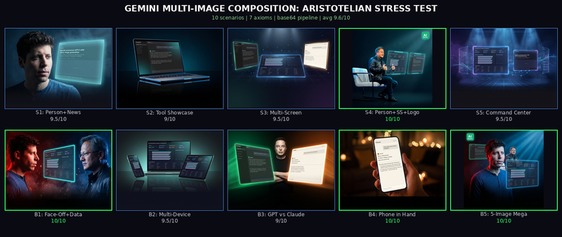

### News Hook Editorial Style (@therundownai)

Single-person portrait + bold headline compositor (`compose_news_hook.py`). AI transforms any CC photo into a dramatic editorial portrait, then overlays auto-sized Inter Black headline.

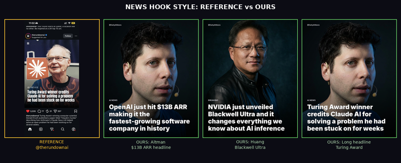

---

## 10 Content Categories with Unique Design Languages

Each category has a **complete, unique visual design language** -- not just different colors, but different typography, layout geometry, decorative grammar, information density, depth model, and visual rhythm. Derived from 7 independent perceptual axes using Aristotelian first-principles reasoning.

### The 7-Axis Design Language System

Every design language varies across 7 independent perceptual axes. **No two categories share values on more than 2 axes** (mathematically verified):

| Axis | What It Controls | Example Range |
|------|-----------------|---------------|
| **Color Palette** | Background, text, accent, gradient | Ivory/navy to deep-space/violet |
| **Typography** | Font family, weight, spacing | Palatino serif to Inconsolata mono |
| **Layout Geometry** | Alignment, cards, margins | Academic journal to Bloomberg terminal |
| **Decorative Grammar** | Corners, borders, patterns, dividers | Pill badges to sharp angular edges |
| **Information Density** | Whitespace, breathing room | Airy academic to dense reference |
| **Depth Model** | Shadows, layering, glass effects | Flat print to glass morphism |
| **Visual Rhythm** | Element repetition, flow | Strict grid to organic floating |

### All 10 Hook Slides


| # | Category | Font | Accent | Corners | Depth | Real-World Precedent |
|---|----------|------|--------|---------|-------|---------------------|
| 1 | **Paper Decoder** | Palatino serif | Navy #1A3A5C | Small 3pt | Flat | Scientific journals |
| 2 | **Tool Showdown** | Roboto bold | Orange #FF6B2C | Sharp 0pt | Layered | ESPN scorecards |
| 3 | **Breaking News** | Helvetica condensed | Red #DC2626 | Sharp 0pt | Flat | CNN/BBC ticker |
| 4 | **Tool Tutorial** | Cabin humanist | Green #16A34A | Pill 12pt | Subtle | Duolingo/Notion |
| 5 | **Hot Take** | Avant Garde heavy | Yellow #EAB308 | Sharp 0pt | Flat | Protest posters |
| 6 | **Prompt Playbook** | Inconsolata mono | Rust #B45309 | Tiny 2pt | Subtle | Recipe cards/terminal |
| 7 | **Industry Map** | OpenSans technical | Blue #3B82F6 | Tiny 2pt | Layered | Bloomberg terminal |
| 8 | **Build This** | Charter geometric | Teal #0D9488 | Small 4pt | Subtle | Architecture blueprints |
| 9 | **Founders & Money** | Palatino elegant | Green #166534 | Hair 1pt | Flat | Financial Times/WSJ |
| 10 | **Future Scenario** | Bookman readable | Violet #A78BFA | Soft 10pt | Glass | Planetarium/Apple keynote |

### Body Slide Comparison (v2 -- Unique Design Languages)

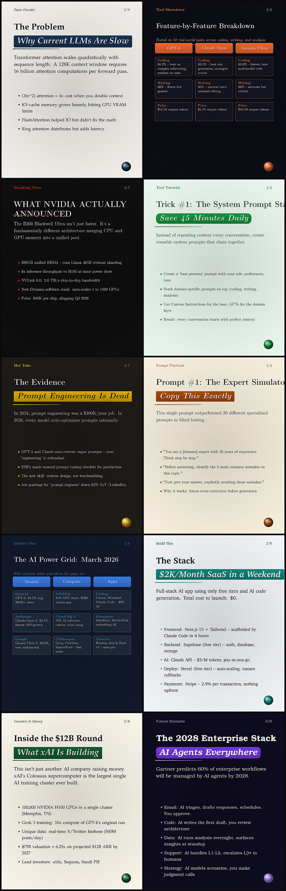

Compare with the v1 body slides where 6/10 categories looked identical. Now every single body slide has its own visual identity: different background, font, accent color, card style, and density.

### Full Pipeline: Hook + Body + AI Diagram + Specialty

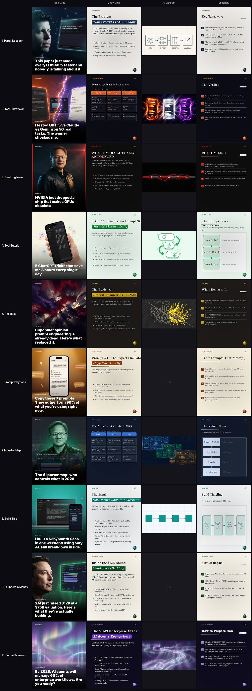

Each category also has AI-generated mid-carousel diagrams (via Gemini 3 Pro) that match the category's visual language. The design language spec is defined in [`scripts/design_languages.py`](scripts/design_languages.py) -- a parameterized JSON format that any new category can populate.

Full category framework with psychology axioms in [CATEGORIES.md](CATEGORIES.md).

---

## Brand Management System

The skill includes a full brand management system ([`scripts/brand_manager.py`](scripts/brand_manager.py)) that turns any Instagram channel into a persistent brand with its own unique design language.

### How It Works

1. **Onboarding Interview** -- 4 questions: niche, tone, visual energy, brand name
2. **Automatic Design Language Derivation** -- Maps answers to 7-axis positions via derivation tables
3. **AI Logo Generation** -- Creates a brand logo matching the derived design language
4. **Persistent Memory** -- Saves brand identity, design language, and content log to `brands/{slug}/`
5. **Content Tracking** -- Excel-based topic tracker with deduplication (no repeat topics)
6. **Multi-Brand Support** -- Manage unlimited brands, each with a completely unique visual identity

### Same Content, Different Brands

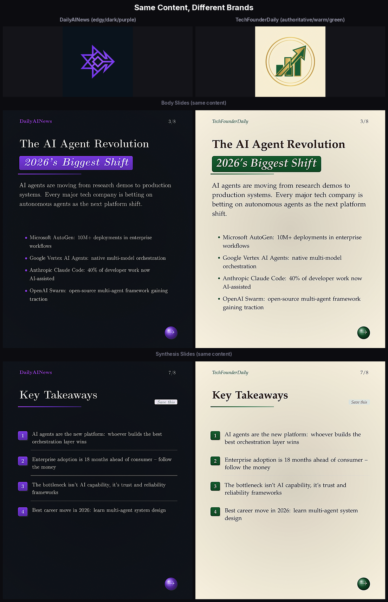

The same carousel content rendered with two brand design languages -- every visual element differs (background, font, accent color, card style, depth) while the content stays identical.

### Brand Data Structure

```
brands/{slug}/
├── brand.json              # Brand identity + design language
├── logo.png                # AI-generated brand logo
├── design_language.json    # 7-axis spec for renderer
└── content_log.xlsx        # Topics covered + dates + metrics
```

### Derivation Table (Interview -> Design Language)

| Interview Answer | Axes Affected | Example Mapping |
|-----------------|---------------|-----------------|
| **Tone: Authoritative** | Typography + Density + Depth | Palatino serif, balanced, flat |
| **Tone: Edgy** | Typography + Density + Depth | Avant Garde, medium, flat |
| **Niche: AI/Tech** | Color + Decoration | Purple accent, circuit pattern |
| **Niche: Business** | Color + Decoration | Green/gold accent, clean rules |
| **Energy: Dark Dramatic** | Layout + Rhythm + Background | Dark bg, organic, sharp 3pt corners |
| **Energy: Warm Inviting** | Layout + Rhythm + Background | Cream bg, organic, round 5pt corners |

---

## 7 Content Archetypes

The skill auto-selects the best archetype based on your topic:

| Archetype | Best For | Example |
|-----------|----------|---------|
| **Tutorial** | Step-by-step how-to | "Deploy with Vercel in 5 minutes" |
| **Framework** | Reusable mental models | "The 3-layer content system" |
| **Myth-Buster** | Correcting common beliefs | "Stop using RAG. There's a better way." |
| **Case Study** | Success stories with data | "How we grew from 0 to 10K users" |
| **Curated List** | Top N tools/resources | "6 AI tools that will replace your stack" |
| **Deep Dive** | Complex concept explained | "How transformers actually work" |
| **Transformation** | Before/after journey | "From burnout to 4-hour workdays" |

Each archetype defines: slide structure, value test, hook pattern, and music profile.

---

## 4 Color Themes

| Theme | Background | Accent | Best For |
|-------|-----------|--------|----------|
| `dark` | Deep indigo `#0D1117` | Electric purple `#7C3AED` | Tech, AI, coding |
| `warm` | Parchment `#F5F0EB` | Terracotta `#B45309` | Mindset, philosophy |
| `clean` | White `#FFFFFF` | Trust blue `#2563EB` | Education, tutorials |
| `earth` | Sage `#1B3A2D` | Gold `#16A34A` | Business, strategy |

Themes are auto-detected from topic keywords or set via brand config.

---

## Brand Configuration

Every visual element is customizable through JSON brand configs:

```json
{
  "name": "TechStack AI",
  "logo": "path/to/logo.png",
  "theme": "dark",
  "accent_override": "6366F1",
  "font_serif": "newpxtext",
  "header_style": "bold",
  "nav_style": "circle",
  "divider_style": "line",
  "corner_radius": "6pt"
}
```

This means one skill serves unlimited brands -- just swap the config file.

---

## The Bullshit Test (Quality Gate)

Every slide must pass ALL 3 conditions before rendering:

| Condition | Question | FAIL Example | PASS Example |
|-----------|----------|-------------|-------------|
| **Specificity** | Could someone with zero knowledge guess this? | "Use the right tools" | "Obsidian's graph view lets Claude traverse 10x more docs" |
| **Novelty** | Has the viewer seen this before? | "AI is changing the world" | "Bidirectional links turn the context window into a navigation system" |
| **Density** | Can it be compressed further? | "There are many benefits including several key advantages" | "3 benefits: 10x nav, auto-linked memory, zero-config" |

If a slide fails any condition, it gets rewritten. No exceptions.

---

## Quick Start

### Prerequisites

- **Python 3.10+**
- **LaTeX** (`pdflatex` with TikZ, microtype, fontenc packages)
- **pdftoppm** (from poppler-utils)
- **Pillow** (Python imaging)
- **AI_GATEWAY_API_KEY** environment variable (for Gemini 3 Pro image generation)

### Render a Single Slide

```bash
python3 scripts/render_latex_slide.py \
  --type hook \
  --data hook_data.json \
  --output slide_01.png \
  --theme dark \
  --brand brand.json
```

### Generate a Full Carousel

```bash
python3 scripts/generate_carousel.py \
  --spec carousel_spec.json \
  --output-dir outputs/ \
  --brand brand.json
```

### Generate AI Images

```bash
python3 ~/.claude/skills/generate-image/scripts/generate_image.py \
  "Dramatic cinematic composition, glowing neon circuits, volumetric lighting, \
  deep indigo and purple tones, no text no words no letters" \
  --model "google/gemini-3-pro-image-preview" \
  --output hook_bg.png
```

---

## Project Structure

```
world-class-carousel/
├── README.md                  # This file
├── SKILL.md                   # Full skill specification (agent instructions)
├── KNOWN_ISSUES.md            # Compressed rules from 8+ sessions
├── scripts/
│   ├── render_latex_slide.py  # Primary LaTeX renderer (6 slide types)
│   ├── generate_carousel.py   # Orchestrator (spec -> full carousel)
│   ├── assemble_carousel.py   # Validation, optimization, preview grid
│   ├── compose_hook.py        # Viral hook compositing (PIL)
│   ├── render_slide.py        # Legacy Pillow renderer
│   └── generate_visuals.py    # AI image generation helper
├── docs/
│   └── images/                # README images and examples
├── templates/                 # Starter templates
└── references/                # Research references
```

---

## Key Design Decisions

### Why LaTeX Instead of HTML/Pillow?

| Feature | LaTeX | HTML Canvas | Pillow |
|---------|-------|-------------|--------|
| Line breaking | Knuth-Plass optimal | CSS heuristic | Manual |
| Font kerning | Professional (microtype) | Basic | None |
| Vector diagrams | TikZ (native) | SVG (external) | Raster only |
| Typography quality | Publication-grade | Web-grade | Basic |
| Reproducibility | Deterministic | Browser-dependent | Deterministic |

### Why AI Images Over Screenshots?

Screenshots were tested extensively and abandoned. They consistently look terrible: low resolution, poorly framed, badly integrated. AI-generated images via Gemini 3 Pro produce far superior results -- cinematic quality, perfect framing, consistent style.

### Why Text-Only Body Slides?

A/B tested across 7 visual strategies with identical content, scored 1-10:

| Strategy | Score |
|----------|-------|
| Text-only body + AI hook/CTA | **8.3/10** |
| AI images on every slide | 5.7/10 |
| Screenshots on tool slides | 4.2/10 |

Images on body slides destroy 40% of content space for minimal visual gain. The text IS the value. Let it breathe.

---

## Instagram Algorithm Optimization

Built-in optimization for the Instagram algorithm:

- **Save Rate** is the #1 signal -- every carousel includes a save-worthy synthesis slide
- **10-slide carousels** outperform shorter ones by ~30% in save rate
- **Music** adds 15-30% reach boost -- skill includes music recommendations per content type
- **First hour** saves get exponential distribution -- carousels are designed for immediate impact
- **Hashtag strategy**: 5-15 with distribution across broad, niche, community, and branded

---

## Learning System

The skill has a two-tier memory architecture that improves with every use:

**Tier 1: `KNOWN_ISSUES.md`** -- Max 60 lines of compressed, actionable rules. Read at the start of every session. Rules get replaced, never appended.

**Tier 2: `session-archives/`** -- Verbose session logs with full experiment data. Never loaded into context unless explicitly requested.

The compression principle: every lesson must be reduced to its irreducible form before entering Tier 1.

---

## Contributing

This skill was built through iterative experimentation -- each session produces carousels, scores them, and distills the lessons into rules. The best way to contribute:

1. Use the skill to generate carousels on different topics
2. Score the output honestly (1-10 on each slide)
3. Identify patterns that work vs fail
4. Compress findings into one-line rules
5. Submit as additions to `KNOWN_ISSUES.md`

---

## License

MIT

---

<p align="center">
  <em>Built with first-principles reasoning. Every decision traces to an axiom.</em><br/>
  <em>Content people save, share, and come back to. Not engagement bait. Not AI slop.</em>
</p>

---

## Keywords

> *For the search engines and the curious humans who find things by typing random words*

Instagram carousel generator, AI carousel maker, social media content creator, LaTeX slide generator, Instagram post template, carousel design tool, AI image carousel, publication-ready carousel, content creation AI, Instagram marketing tool, social media automation, Gemini AI images, TikZ graphics, professional carousel, influencer content tool, Claude Code skill

